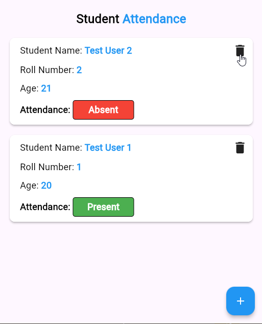
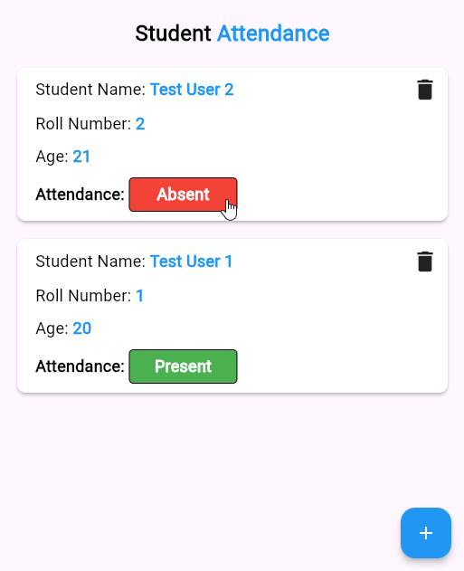
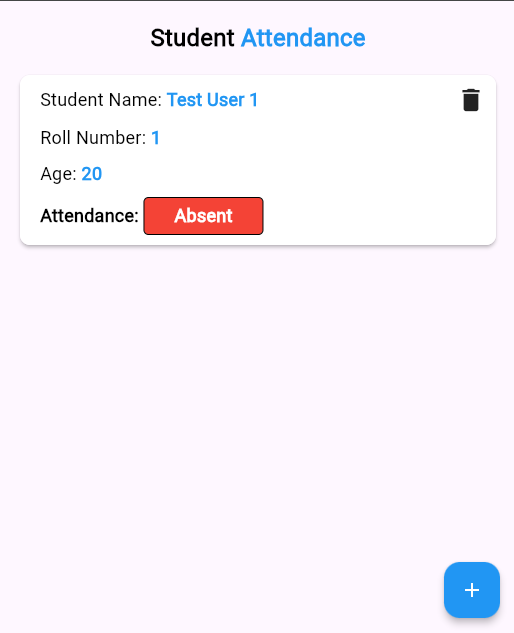
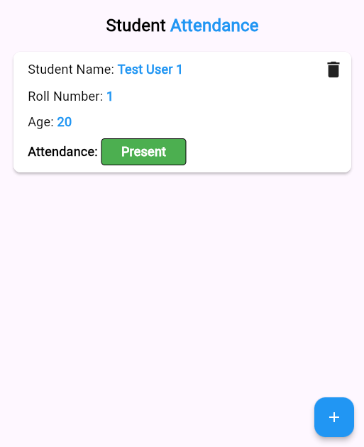
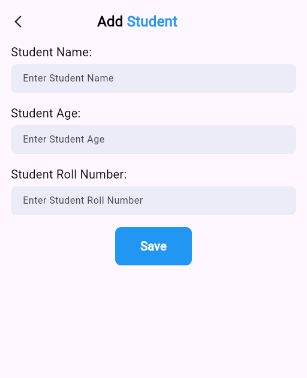
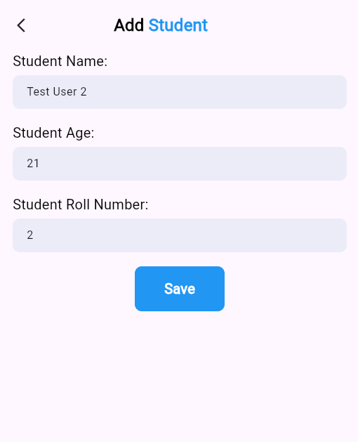
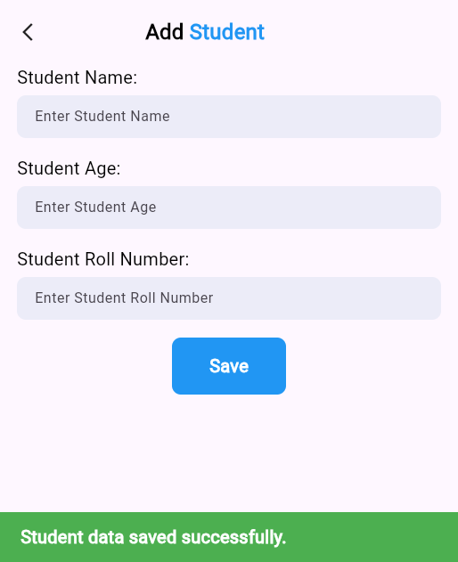
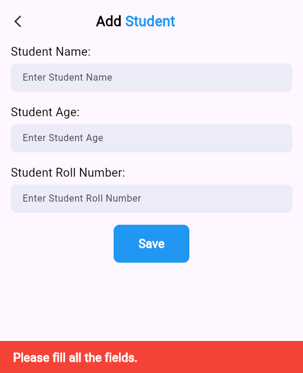

# CRUD-Flutter-Firebase
Aplicação Flutter com integração Firebase Firestore para cadastro, listagem, edição, exclusão e controle de presença de estudantes. Interface intuitiva, suporte a mouse (cursor pointer) e feedback visual. Ideal para estudos de CRUD em Flutter com backend em nuvem usando Firebase.

# Documentação do Arquivo main.dart

Este arquivo é o ponto de entrada da aplicação Flutter integrada ao Firebase, responsável por inicializar os serviços essenciais e definir o widget raiz da interface.

---

## Sumário

- Visão Geral
- Importações
- Função Principal (`main`)
- Classe Principal (`MyApp`)
- Execução
- Dependências

---

## Visão Geral

O arquivo main.dart inicializa o Flutter e o Firebase, e define o widget principal da aplicação, que utiliza o padrão Material Design e tem como tela inicial o widget `Home`.

---

## Importações

- `flutter/material.dart`: Biblioteca principal de widgets do Flutter.
- `flutter_firebase_crud/pages/home.dart`: Página inicial personalizada da aplicação.
- `firebase_core/firebase_core.dart`: Inicialização do Firebase.
- `firebase_options.dart`: Configurações específicas do Firebase para o projeto.

---

## Função Principal (`main`)

```dart
void main() async {
  WidgetsFlutterBinding.ensureInitialized();
  await Firebase.initializeApp(options: DefaultFirebaseOptions.currentPlatform);
  runApp(const MyApp());
}
```

- **WidgetsFlutterBinding.ensureInitialized()**: Garante que o binding do Flutter esteja pronto antes de inicializar plugins.
- **Firebase.initializeApp**: Inicializa o Firebase com as opções da plataforma.
- **runApp(const MyApp())**: Executa o widget principal da aplicação.

---

## Classe Principal (`MyApp`)

```dart
class MyApp extends StatelessWidget {
  const MyApp({super.key});

  @override
  Widget build(BuildContext context) {
    return MaterialApp(
      debugShowCheckedModeBanner: false,
      title: 'Flutter Firebase CRUD - Student Attendance',
      theme: ThemeData(
        colorScheme: ColorScheme.fromSeed(seedColor: Colors.deepPurple),
      ),
      home: Home(),
    );
  }
}
```

- **MaterialApp**: Define o tema, título e tela inicial da aplicação.
- **debugShowCheckedModeBanner**: Remove a faixa de debug.
- **theme**: Utiliza um esquema de cores baseado em roxo.
- **home**: Define o widget `Home` como tela inicial.

---

## Execução

Para rodar a aplicação, utilize o comando:

```sh
flutter run
```

---

## Dependências

- Flutter SDK
- firebase_core
- Arquivo de opções do Firebase (`firebase_options.dart`)
- Página inicial (`pages/home.dart`)

---

**Arquivo:** main.dart

# Documentação do Arquivo home.dart

Este arquivo implementa a tela principal da aplicação de controle de presença de estudantes, utilizando Flutter e integração com o Firebase Firestore.

---

## Sumário

- Visão Geral
- Importações
- Classe Home
- Principais Métodos e Funcionalidades
  - showStudentsList()
  - build()
- Interação com Firestore
- Componentes da Interface
- Como Funciona a Presença
- Adicionar Estudante
- Exemplos Visuais

---

## Visão Geral

A tela `Home` exibe uma lista de estudantes cadastrados no Firestore, permitindo visualizar informações, alterar o status de presença e remover estudantes. Também oferece um botão para adicionar novos estudantes.

---

## Importações

- `cloud_firestore.dart`: Para acesso ao banco de dados Firestore.
- `flutter/material.dart`: Componentes visuais do Flutter.
- `add_student.dart`: Tela para adicionar novos estudantes.
- `services/firestore_database.dart`: Serviço para operações CRUD no Firestore.

---

## Classe Home

- **Tipo:** `StatefulWidget`
- **Descrição:** Widget principal da tela de presença dos estudantes.
- **Estado:** `_HomeState`

---

## Principais Métodos e Funcionalidades

### showStudentsList()

- Retorna um `StreamBuilder` que escuta as alterações na coleção de estudantes do Firestore.
- Exibe cada estudante em um `ListView`, mostrando nome, número de matrícula, idade e status de presença.
- Permite:
  - Alterar o status de presença (Presente/Ausente) com um clique.
  - Remover um estudante com o ícone de lixeira.

### build()

- Monta a interface principal da tela:
  - Título "Student Attendance"
  - Lista de estudantes (expandida)
  - Botão flutuante para adicionar novo estudante

---

## Interação com Firestore

- **Leitura:** Utiliza um stream para listar estudantes em tempo real.
- **Atualização:** Permite alternar o status de presença do estudante.
- **Remoção:** Permite deletar um estudante do banco de dados.

---

## Componentes da Interface

- **ListView:** Lista de estudantes.
- **Container:** Exibe informações de cada estudante.
- **Botão de presença:** Verde para "Presente", vermelho para "Ausente", ambos clicáveis para alternar o status.
- **FloatingActionButton:** Adiciona novo estudante.

---

## Como Funciona a Presença

- O status de presença é um booleano (`attendance`).
- Se `true`, exibe "Present" (verde); se `false`, exibe "Absent" (vermelho).
- Ao clicar, o status é alternado e atualizado no Firestore.

---

## Adicionar Estudante

- O botão flutuante abre a tela de cadastro de estudante (`AddStudent`).

---

## Exemplos Visuais

Abaixo, exemplos da interface de listagem e controle de presença dos estudantes:

### Cursor sobre o botão de deletar



### Cursor sobre o botão de presença "Absent"



### Apenas um estudante listado - ausente



### Apenas um estudante listado - presente



---

**Arquivo:** home.dart

# Documentação do Arquivo add_student.dart

Este arquivo implementa a tela de cadastro de estudantes para a aplicação Flutter integrada ao Firebase Firestore.

---

## Visão Geral

A tela `AddStudent` permite ao usuário inserir os dados de um novo estudante (nome, idade e número de matrícula) e salvá-los no banco de dados Firestore. Também oferece feedback visual sobre o sucesso ou erro no cadastro.

---

## Importações

- `flutter/material.dart`: Componentes visuais do Flutter.
- `flutter_firebase_crud/services/firestore_database.dart`: Serviço para operações CRUD no Firestore.
- `random_string/random_string.dart`: Geração de IDs aleatórios para estudantes.

---

## Classe Principal

### AddStudent

- **Tipo:** `StatefulWidget`
- **Descrição:** Tela para adicionar um novo estudante.
- **Estado:** `_AddStudentState`

---

## Principais Componentes e Funcionalidades

### Controladores de Texto

- `studentNameController`: Controla o campo de nome do estudante.
- `studentAgeController`: Controla o campo de idade do estudante.
- `studentRollNumberController`: Controla o campo de número de matrícula.

### Interface

- **AppBar customizada:** Com botão de voltar e título "Add Student".
- **Campos de texto:** Para nome, idade e número de matrícula, cada um com rótulo e campo de entrada.
- **Botão "Save":** Salva os dados do estudante no Firestore.

### Validação

- Antes de salvar, verifica se todos os campos estão preenchidos.
- Exibe um `SnackBar` vermelho caso algum campo esteja vazio.

### Salvando no Firestore

- Gera um ID aleatório para o estudante.
- Cria um mapa com os dados do estudante, incluindo o campo `"attendance": false`.
- Chama o método `addStudent` do serviço Firestore.
- Exibe um `SnackBar` verde em caso de sucesso e limpa os campos.

---

## Fluxo de Cadastro

1. Usuário preenche os campos.
2. Ao clicar em "Save":
   - Se algum campo estiver vazio, exibe mensagem de erro.
   - Se todos os campos estiverem preenchidos:
     - Salva os dados no Firestore.
     - Exibe mensagem de sucesso.
     - Limpa os campos para novo cadastro.

---

## Observações

- O botão de voltar retorna para a tela anterior.
- O campo de presença do estudante é sempre iniciado como `false` (ausente).
- O layout utiliza espaçamentos e estilos para melhor usabilidade.

---

## Exemplos Visuais

Abaixo, exemplos da interface de cadastro de estudantes:

### Tela de cadastro vazia



### Campos preenchidos para cadastro



### Feedback de erro ao tentar salvar sem preencher todos os campos



### Feedback de sucesso ao salvar estudante



---

**Arquivo:** add_student.dart

# Documentação do Arquivo firestore_database.dart

Este arquivo define a classe `FirestoreDatabase`, responsável por realizar operações CRUD na coleção `students` do Firestore.

---

## Visão Geral

A classe `FirestoreDatabase` centraliza o acesso ao banco de dados Firestore, fornecendo métodos para adicionar, listar, atualizar e remover estudantes.

---

## Métodos

### `Future addStudent(Map<String, dynamic> studentData, String studentId)`

- **Descrição:** Adiciona um novo estudante à coleção `students` com o ID fornecido.
- **Parâmetros:**
  - `studentData`: Mapa com os dados do estudante (nome, idade, matrícula, presença, etc).
  - `studentId`: String com o ID único do estudante.
- **Retorno:** `Future` que completa quando a operação termina.
- **Tratamento de Erros:** Imprime mensagem de erro no console.

---

### `Stream<QuerySnapshot> getStudents()`

- **Descrição:** Retorna um stream em tempo real da coleção `students`.
- **Uso:** Permite atualizar a interface automaticamente quando há mudanças nos dados dos estudantes.

---

### `Future updateAttendance(bool attendance, String studentId)`

- **Descrição:** Atualiza o status de presença (`attendance`) de um estudante específico.
- **Parâmetros:**
  - `attendance`: Novo valor booleano para presença.
  - `studentId`: ID do estudante a ser atualizado.
- **Retorno:** `Future` que completa quando a operação termina.
- **Tratamento de Erros:** Imprime mensagem de erro no console.

---

### `Future deleteStudent(String studentId)`

- **Descrição:** Remove um estudante da coleção `students` pelo ID.
- **Parâmetros:**
  - `studentId`: ID do estudante a ser removido.
- **Retorno:** `Future` que completa quando a operação termina.
- **Tratamento de Erros:** Imprime mensagem de erro no console.

---

## Observações

- Todas as operações são assíncronas.
- Os métodos usam tratamento básico de erros, apenas exibindo mensagens no console.
- A coleção utilizada no Firestore é sempre `students`.

---

**Arquivo:** firestore_database.dart